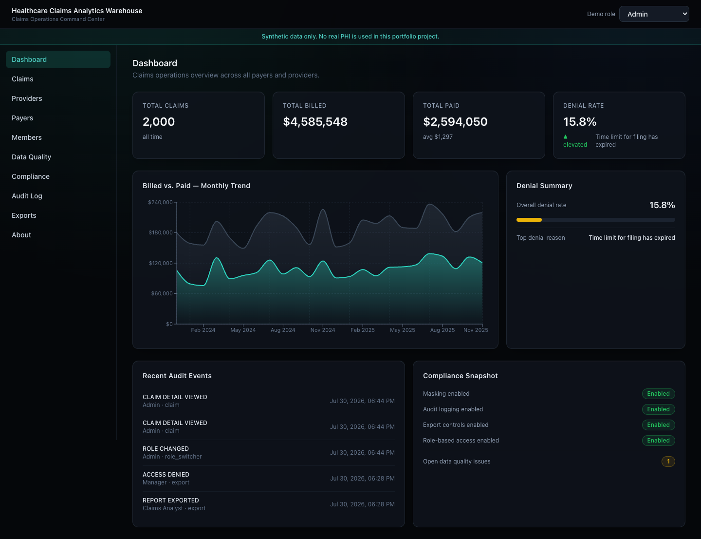
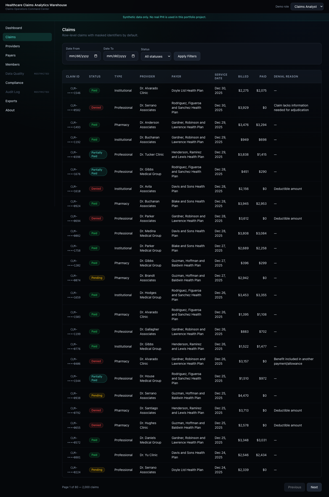
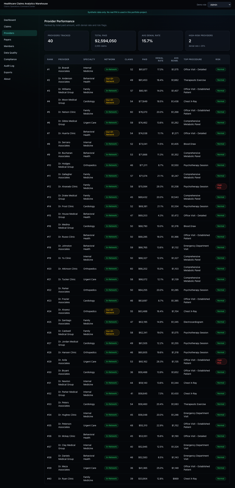
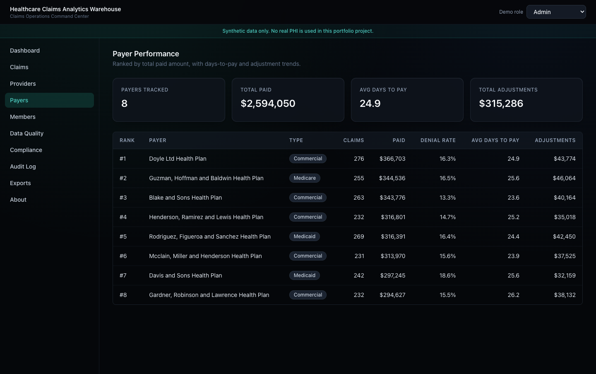
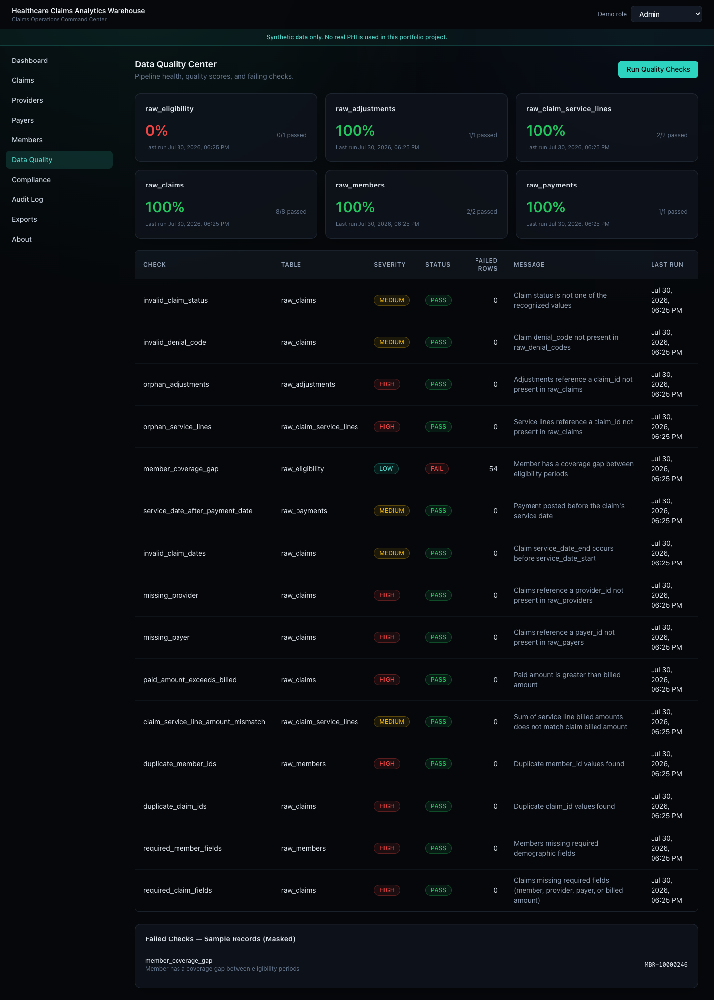
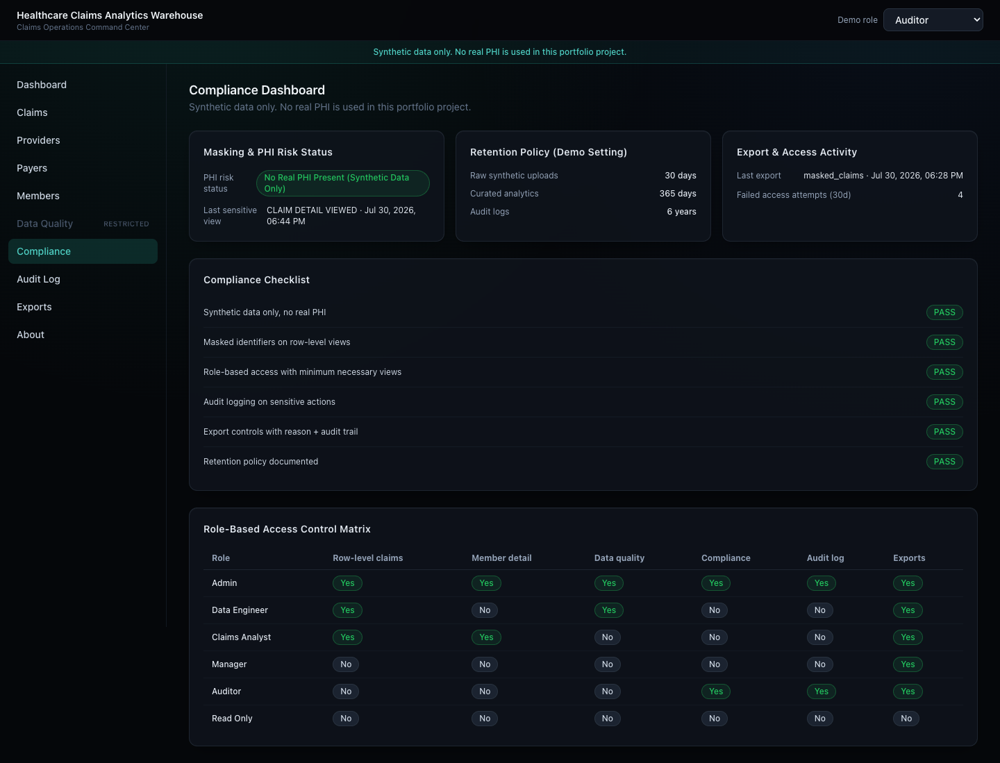

# Healthcare Claims Analytics Warehouse

A production-style, HIPAA-aware healthcare claims analytics warehouse and dashboard, built on synthetic data only.

**Portfolio angle:** Built a HIPAA-aware healthcare claims analytics warehouse using Python, Django, React, PostgreSQL, advanced SQL, role-based views, masked identifiers, audit logging, export controls, and data quality checks.

> **Synthetic data only. No real PHI is used in this portfolio project.**

## Problem Statement

Healthcare claims data is difficult to analyze and govern because claims, service lines, members, providers, payers, denials, adjustments, payments, and eligibility records often live in messy source systems. Teams need trusted SQL marts, quality checks, role-based views, masked identifiers, audit history, and export controls before that data can be safely used for analytics.

This project models that entire pipeline end-to-end — from raw synthetic source tables through staging, a dimensional warehouse, and nine analytics marts — behind a Django REST API and a React operations dashboard.

## HIPAA-Aware Disclaimer

> This project uses synthetic healthcare claims data only. It is designed to demonstrate HIPAA-aware engineering patterns such as role-based access, minimum necessary views, masked identifiers, audit logging, export controls, retention settings, and de-identification-oriented reporting. It is not presented as a certified HIPAA-compliant production system. A production deployment handling real ePHI would require legal review, risk analysis, Business Associate Agreements, secure hosting, operational safeguards, policies, monitoring, and staff procedures.

## Tech Stack

- **Backend:** Python, Django, Django REST Framework, PostgreSQL, psycopg
- **Frontend:** React, TypeScript, Tailwind CSS, Vite, Recharts
- **Data:** Advanced SQL (CTEs, window functions, SCD Type 2, data quality checks), Faker-based synthetic seed data
- **Infra:** Docker Compose (PostgreSQL), GitHub Actions CI

## Architecture Overview

```
raw (Django-managed synthetic tables)
  -> staging (typed/cleaned views)
    -> warehouse (dimensions + facts, surrogate keys)
      -> marts (9 analytics-ready aggregate tables)

audit schema      -> audit.audit_events (sensitive-action logging)
compliance schema -> compliance.data_quality_results, compliance dashboard data

Django REST Framework API  <-  reads from marts/warehouse via raw SQL, applies
                                role checks + identifier masking
React + TypeScript dashboard <- role-aware, masking-aware, dark-mode UI
```

The raw layer is the only layer Django's ORM writes to directly (via `manage.py migrate`). Staging views, warehouse dimensions/facts, and all nine marts are built by executing the SQL files in `backend/sql/` through the `build_marts` management command — this is a deliberately SQL-first pipeline, not a Django-models-all-the-way-down app.

## Django Backend Overview

- `backend/config/` — settings, root URLs, WSGI/ASGI
- `backend/apps/warehouse/` — raw-layer models, claims/dashboard/data-quality/export APIs, and the four core services:
  - `services/masking.py` — identifier masking (`MBR-10039281` → `MBR-••••9281`)
  - `services/roles.py` — role → permission matrix for the 6 demo roles
  - `services/audit.py` — audit event logging
  - `services/exports.py` — export generation + control checks
  - `services/data_quality.py` — parses and runs the SQL checks in `backend/sql/quality/`
- `backend/apps/compliance/` — `AuditEvent` and `DataQualityResult` models, compliance summary + audit log APIs
- `backend/apps/analytics/` — provider/payer/member performance APIs, about-project API
- `backend/sql/` — every schema, table, view, mart, index, and quality check as plain `.sql` files
- `backend/tests/` — masking, roles, data quality, and export control tests

## React Frontend Overview

- `frontend/src/routes/` — one page per app route (`/`, `/claims`, `/providers`, `/payers`, `/members`, `/data-quality`, `/compliance`, `/audit-log`, `/exports`, `/about`)
- `frontend/src/components/ui/` — shared design system (Card, MetricCard, Badge, Table, FilterBar, RoleSwitcher, MaskedIdentifier, AppShell, ...)
- `frontend/src/components/{dashboard,claims,providers,payers,members,data-quality,compliance,audit,exports}/` — page-specific components
- `frontend/src/lib/` — `api.ts` (fetch client that sends the demo role via `X-Demo-Role`), `roles.ts`, `masking.ts`, `formatters.ts`
- `frontend/src/hooks/` — `useRole` (role context + persistence), `useAnalytics` (generic data-fetching hook)

The dashboard has no real login — the `RoleSwitcher` in the top nav lets you demo all 6 roles instantly. The API is the real enforcement boundary: every request carries an `X-Demo-Role` header, and the backend decides what to return, mask, or deny — the frontend just reflects that.

## Database Layer

PostgreSQL, with six schemas:

| Schema | Purpose | Owned by |
|---|---|---|
| `raw` | Synthetic, source-system-shaped tables | Django migrations |
| `staging` | Typed/cleaned views over `raw` | SQL files (`build_marts`) |
| `warehouse` | Dimensional model: dims + facts on surrogate keys | SQL files (`build_marts`) |
| `marts` | 9 analytics-ready aggregate tables | SQL files (`build_marts`) |
| `audit` | `audit_events` | Django migrations |
| `compliance` | `data_quality_results` | Django migrations |

### Data Model Summary

- **Dimensions:** `dim_member` (SCD Type 2 — tracks plan/demographic changes over time), `dim_provider`, `dim_payer`, `dim_date`, `dim_diagnosis_category`, `dim_procedure_category`, `dim_denial_reason`
- **Facts:** `fact_claim`, `fact_claim_service_line`, `fact_payment`, `fact_adjustment`, `fact_eligibility_coverage`
- Every fact/dim join uses surrogate `analytics_*_key` columns (`analytics_member_key`, `analytics_claim_key`, `analytics_provider_key`, `analytics_payer_key`) — marts never join on raw business identifiers.

### SQL Marts

1. `mart_claims_summary` — monthly claim volume, billed/paid, denial rate
2. `mart_denial_trends` — denial reasons ranked by volume per month (`RANK()` window function)
3. `mart_provider_performance` — provider ranking, denial rate, top procedure category
4. `mart_payer_performance` — payer ranking, avg days-to-pay, adjustment totals
5. `mart_member_utilization` — utilization by surrogate member key, `NTILE(100)` cost percentile, high-cost flag
6. `mart_payment_reconciliation` — billed vs. paid vs. adjustments variance detection
7. `mart_monthly_claims_kpis` — month-over-month growth via `LAG()`
8. `mart_data_quality_scorecard` — pass/fail rollup per table
9. `mart_compliance_audit_summary` — daily audit activity rollup

### Data Quality Checks

15 SQL-defined checks in `backend/sql/quality/001_quality_checks.sql`, covering: required claim/member fields, duplicate claim/member IDs, service-line amount mismatches, paid-exceeds-billed, missing payer/provider, invalid claim dates, payment-before-service-date, member coverage gaps, orphan service lines/adjustments, invalid denial codes, and invalid claim status. Run via `python manage.py run_quality_checks`, results land in `compliance.data_quality_results`.

## Compliance-Minded Design

### Role-Based Access

Six demo roles, switchable instantly via the `RoleSwitcher`:

| Role | Sees |
|---|---|
| Admin | Everything — compliance settings, role controls, unmasked identifiers |
| Data Engineer | Data quality checks, pipeline status |
| Claims Analyst | Claims analytics with masked identifiers |
| Manager | Aggregate KPIs only (no row-level claim/member detail) |
| Auditor | Audit logs and compliance dashboard |
| Read Only | Summary dashboards only |

### Masking Strategy

Identifiers are masked with a consistent pattern, implemented once in `backend/apps/warehouse/services/masking.py` and mirrored in `frontend/src/lib/masking.ts`:

```
MBR-10039281      -> MBR-••••9281
CLM-2026-000938   -> CLM-••••0938
```

Every role except Admin receives masked `claim_id`/`member_id`/`subscriber_id` from the API. Dates of birth, addresses, phone numbers, and emails have dedicated masking helpers as well.

### Audit Logging Strategy

Every sensitive action creates an `audit.audit_events` row: `CLAIM_DETAIL_VIEWED`, `MEMBER_DETAIL_VIEWED`, `REPORT_EXPORTED`, `ROLE_CHANGED`, `ACCESS_DENIED`, `DATA_QUALITY_CHECK_RUN`, `DATA_QUALITY_CHECK_FAILED`, `RETENTION_JOB_RAN`. Logged in `backend/apps/warehouse/services/audit.py`, viewable at `/audit-log` (Admin/Auditor only).

### Export Control Strategy

Every export (`/exports`) requires: a role check against an export-type matrix, a stated business reason, and creates a `REPORT_EXPORTED` audit event. Managers get aggregate-only exports; Claims Analysts get masked row-level exports; Auditors get audit exports; Admins get everything. Implemented in `backend/apps/warehouse/services/exports.py`.

### Retention Policy (Demo Setting)

Shown on the Compliance Dashboard: raw synthetic uploads retained 30 days, curated analytics retained 1 year, audit logs retained 6 years. This is a documented demo setting, not an enforced deletion job.

## How to Run Locally

### Prerequisites

Docker, Python 3.11+, Node 20+.

### 1. Clone and configure environment

```bash
cp .env.example .env
```

Never commit a real `.env` file — only `.env.example` is checked in.

### 2. Start PostgreSQL

```bash
docker compose up -d
```

### 3. Backend

```bash
cd backend
python3 -m venv .venv && source .venv/bin/activate
pip install -r requirements.txt
python manage.py migrate
python manage.py seed_synthetic_claims
python manage.py build_marts
python manage.py run_quality_checks
python manage.py build_marts   # re-run once more so the data-quality scorecard mart picks up the check results
python manage.py runserver
```

The API is now live at `http://localhost:8000/api/`.

### 4. Frontend

```bash
cd frontend
npm install
npm run dev
```

Open `http://localhost:5173`.

### 5. Run tests / lint / build

```bash
cd backend && python manage.py test tests
cd frontend && npm run lint && npm run build
```

### Resetting the warehouse

```bash
python manage.py reset_warehouse       # truncates raw/warehouse/marts (audit log preserved)
python manage.py seed_synthetic_claims
python manage.py build_marts
```

## Screenshots

**Dashboard** — claims operations overview, monthly billed vs. paid trend, recent audit events, compliance snapshot (Admin role):



**Claims** — row-level claims with masked identifiers by default (Claims Analyst role):



**Providers** — provider ranking by total paid, denial rate, and high-risk flags (Admin role):



**Payers** — payer ranking by total paid, average days-to-pay, and adjustment trends (Admin role):



**Data Quality Center** — quality scorecard by table, all 15 SQL-defined checks, and masked failed-record samples (Admin role):



**Compliance Dashboard** — masking/PHI status, retention policy, compliance checklist, and the full role-based access control matrix (Auditor role):



## Future Roadmap

- Real authentication layered on top of the existing role model
- Materialized views + scheduled refresh instead of truncate/reload marts
- SCD2 history for providers and payers, not just members
- A de-identification/anonymization scoring mart
- CSV/Parquet export to object storage with signed URLs

## Resume Bullet

> Built a HIPAA-aware healthcare claims analytics warehouse using Python, Django, React, PostgreSQL, advanced SQL, synthetic claims data, role-based views, masked identifiers, audit logging, export controls, and data quality checks across claims, payments, denials, providers, payers, and members.
